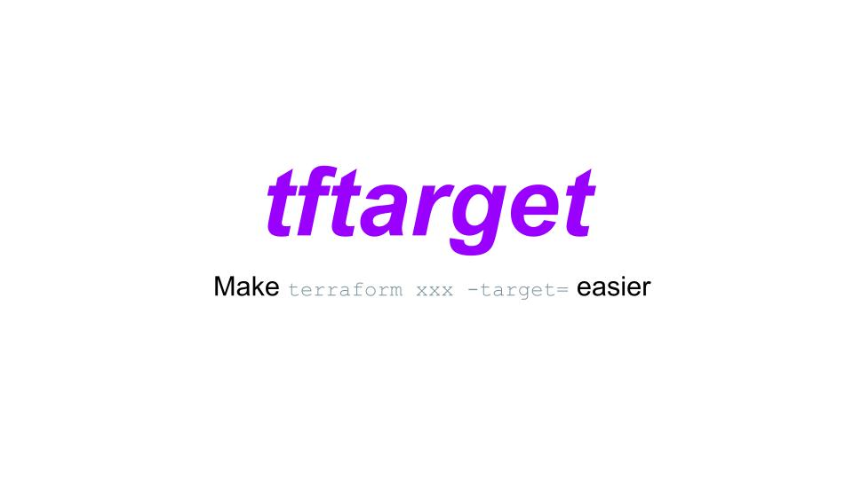
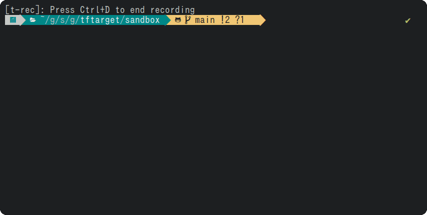
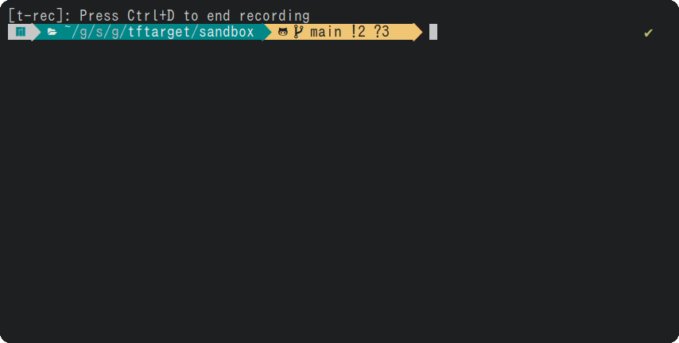
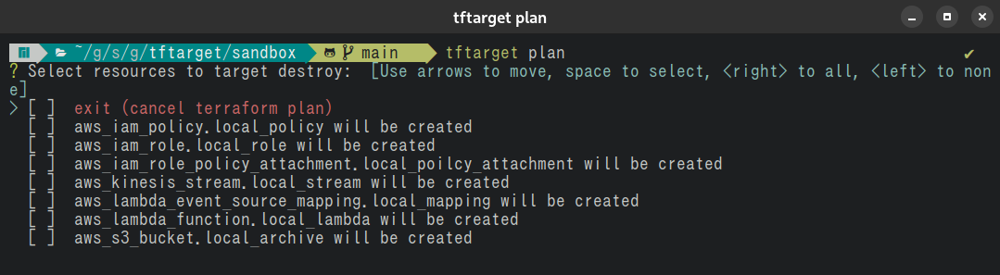
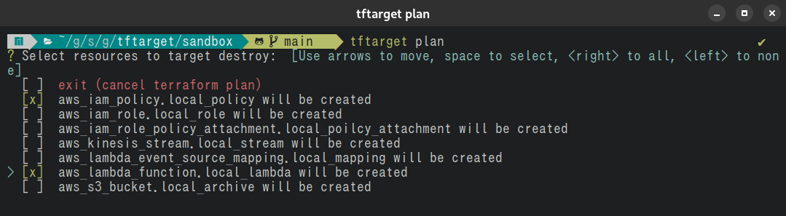
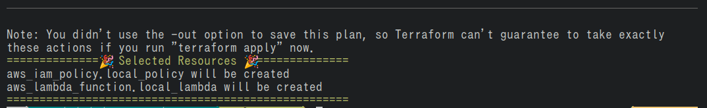
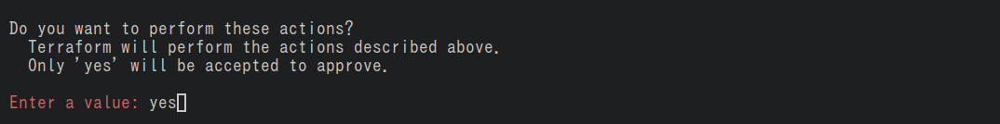
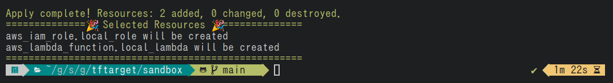

# tftarget
[](https://opensource.org/licenses/MIT)
[](https://pkg.go.dev/github.com/future-architect/tftarget)
[](https://github.com/future-architect/tftarget/actions/workflows/release.yml)
[](https://github.com/future-architect/tftarget/actions/workflows/tagpr.yml)


A Terraform ( plan | apply | destroy ) target tool



## Features
You can interactivity select resource to ( plan | apply | destroy ) with target option. 

## tftarget plan


## tftarget apply


## tftarget destroy


## Requirements
The tftarget invokes the Terraform command, so Terraform must be installed on the local environment.

## Getting Started
We have prepared a sandbox environment where Terraform can be run in a Docker environment, so please clone the repository and try it out.

```shell
$ git clone https://github.com/future-architect/tftarget.git
```

First, build localstack
```shell
$ make localstack
```

Then, change directory, following command.

```shell
$ cd sandbox
```

Now that localstack has started, you should be able to run Terraform.  
Please run the following command to confirm that Terraform is functioning properly.

```shell
$ terraform init
$ terraform plan
```

Once you have reached this point, the preparation is complete.

## Install

### Go

```shell
$ go install github.com/future-architect/tftarget@latest
```

### Homebrew

```shell
$ brew install future-architect/tap/tftarget
```

### Download

Download the latest compiled binaries and put it anywhere in your executable path.

https://github.com/future-architect/tftarget/releases

## Usage

```shell
$ tftarget --help
tftarget is a CLI library for Terraform ( plan | appply | destroy ) with target option.
You can interactivity select resource to ( plan | appply | destroy ) with target option.

Usage:
  tftarget [command]

Available Commands:
  apply       Terraform apply, interactively select resource to apply with target option
  completion  Generate the autocompletion script for the specified shell
  destroy     Terraform destroy, interactively select resource to destroy with target option
  help        Help about any command
  plan        Terraform plan, interactively select resource to plan with target option

Flags:
  -h, --help      help for tftarget
  -v, --version   version for tftarget

Use "tftarget [command] --help" for more information about a command.
```

### Simple Usage

#### Plan

```shell
$ tftarget plan
```



Executing a `tftarget plan` is equivalent to executing a `terraform plan`.
The difference from a normal `terraform plan` is that instead of s detailed plan results, the output is a checkbox with only the resource name and action name displayed.


By selecting this checkbox and executing, the terraform plan can be executed for the selected resource with the target option.



Finally, selected result is output as a summary.



#### Apply

`tftarget apply` is the same flow until the `tftarget plan` and resource are selected.
The difference is that after selecting a resource, you will be prompted to enter `yes`, which will execute `terraform apply`.



As with the `tftarget plan`, the selected resource is output as a summary.



#### Destroy

The use of `tftarget destroy` is exactly the same as that of `tftarget apply`, so we omit the explanation here.

### Advanced Option

plan, apply, and destroy each have Flags options as shown below.

```shell
Flags:
  -f, --filter string   filter by action. You can select create, destroy, update, or replace
  -i, --items int       check box item size (default 25)
  -p, --parallel int    limit the number of concurrent operations (default 10)
  -s, --summary         summary of selected items (default true)
```

#### --filter, -f

The filter option allows you to filter actions on the first resource selection screen. 
For example, if you want to display only newly created resources as an option, do the following

```shell
tftarget apply -f create
```

This option is not available for combined use.
For example, the following commands are treated as invalid

```shell
tftarget apply -f create destroy
```

#### --items, -i

This option allows you to change the number of checkbox choices. The default setting is 25.
If you wish to increase the number of checkboxes to 50, do the following.

```shell
tftarget apply -i 50
```

#### --parallel, -p
--parallel is equivalent to the -parallelism=n option in terraform. The default is set to 10.

```shell
tftarget apply -p 30
```

#### --summary, -s
--summary option is set to true by default. If it is set to false, the following output will be hidden.


```shell
tftarget apply -s false
```

## License
MIT
